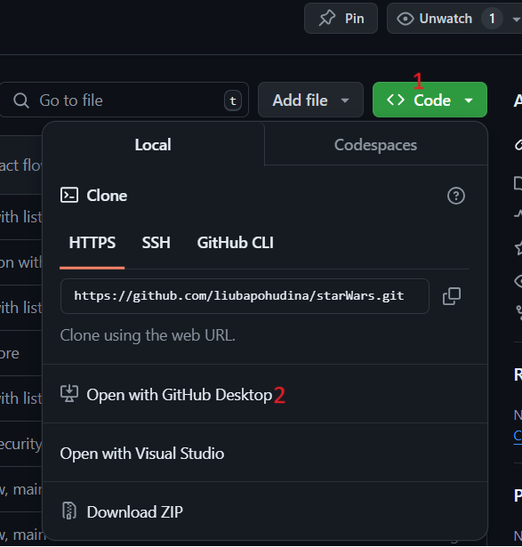
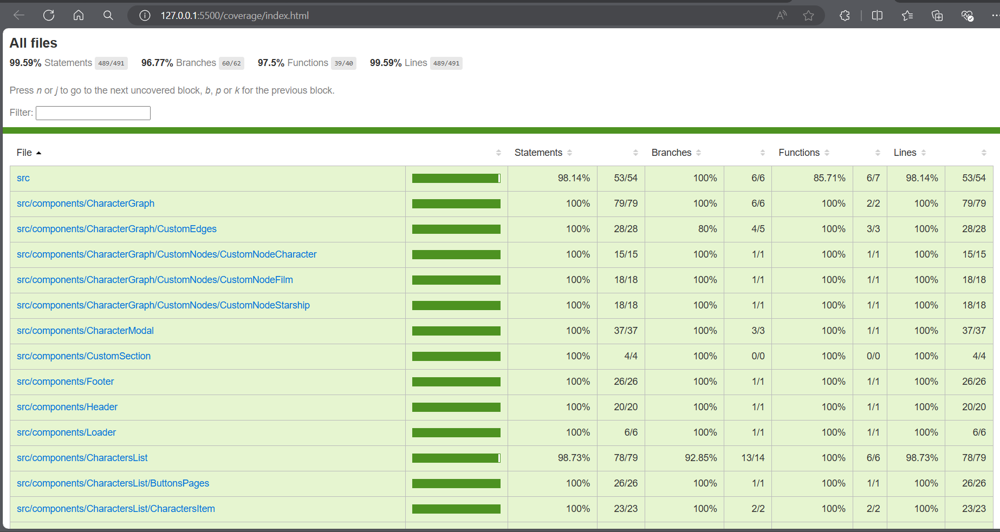
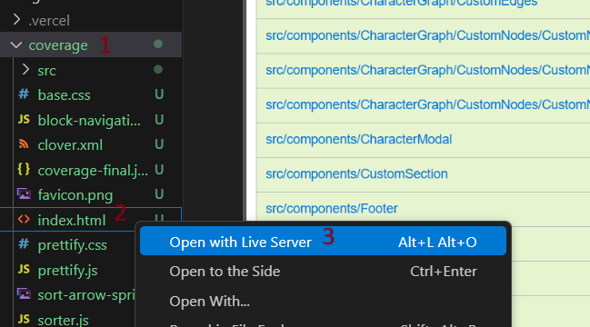

# Star Wars Project

<div style="text-align: center;">
  
</div>

This project is created to provide an overview of information about Star Wars characters. By clicking on a character's card, you can see information about the movies they appeared in and the starships they piloted. The data displayed in this application is sourced from [Star Wars API](http://sw-api.starnavi.io).

## Technologies Used

<div style="display: flex; flex-wrap: wrap; justify-content: center; gap: 10px;">
  <a href="https://react.dev/"> 
    
  </a> 
  <a href="https://reactflow.dev/">
    
  </a>  
  <a href="https://www.typescriptlang.org/">
    
  </a>  
  <a href="https://styled-components.com/">
    
  </a>
  <a href="https://axios-http.com/docs/intro">  
    
  </a>
  <a href="https://www.npmjs.com/">  
    
  </a>  
  <a href="https://vitejs.dev/">
    
  </a>  
</div>

  ## For Testing
<div style="display: flex; flex-wrap: wrap; justify-content: center; gap: 10px;">
  <a href="https://vitest.dev/">
    
  </a>
  <a href="https://testing-library.com/">  
    
  </a>
  <a href="https://github.com/testing-library/jest-dom?tab=readme-ov-file#readme">  
    
  </a>
   <a href="https://sinonjs.org/">  
    
  </a>  
</div>
</div>


## Getting Started

You can clone the repository to your local machine using one of the following methods:

#### Using the Terminal

Open your terminal and run the following command:

```bash
git clone https://github.com/liubapohudina/starWars.git
```

This will clone the repository to your local machine.


#### Using GitHub Interface
Go to the GitHub repository.


1. Click the green Code button.


2. Choose Open with GitHub Desktop to clone the repository using GitHub Desktop.




If you chose Open with GitHub Desktop, follow the prompts to open the repository in GitHub Desktop.

Open the cloned repository in Visual Studio Code:

If you used GitHub Desktop, you can directly open the repository in Visual Studio Code from there.
Alternatively, navigate to the cloned repository folder using your file explorer and open it with Visual Studio Code.


## Navigate to the Project Directory

Change into the project directory:

```bash
cd starWars
```

## Install Dependencies

Install the necessary dependencies using npm:

```bash
npm install
```
## Start the Development Server

Start the development server with the following command:

```bash
npm start
```
This will run the application in development mode and open it in your default web browser. The app will be available at http://localhost:5173/.

## Build for Production

To create a production build of the application, run:

```bash
npm run build
```
This will generate optimized static files in the build directory, which can be deployed to a production server.

# Testing

## Running unit tests

To run the tests, enter the command:

```bash
npm test
```
You can also run tests with coverage. A report on the coverage of the code by tests will be displayed in the terminal. To do this, run

```bash
npm run test:coverage
```
After executing this command, the coverage folder will be created. There is a report on the tests. There is a report that can be opened for review in a browser, as well as printed.

 

### Opening a report in a browser

1. Open the coverage folder.

2. Locate the index.html file.

3. Open with Live Server.

 

## After reviewing the report, the coverage folder can be deleted if the report is no longer needed. If necessary, you can always regenerate the report using the:

```bash
npm run test:coverage
```

